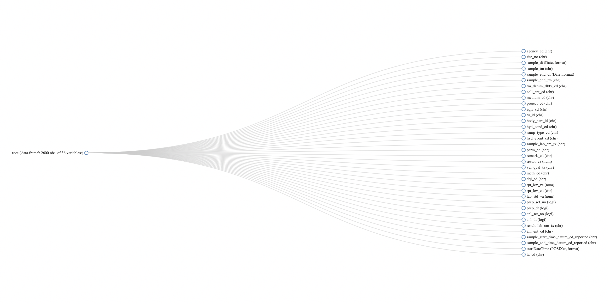

<body style="background-color:white;">

```{r setup, include=FALSE}
library(tufte)
# invalidate cache when the tufte version changes
knitr::opts_chunk$set(cache.extra = packageVersion('tufte'))
options(htmltools.dir.version = FALSE)
```

::: fullwidth
# Introduction

Saltwater intrusion and sea level rise (SWISLR) are complex and intertwined processes that threaten coastal infrastructure and erode biodiverse shoreline habitats. In simpler terms, SWISLR threatens the water quality of coastal communities by flooding sewage infrastructure, leaching toxins into groundwater sources, and contaminating well water. 

Research can help scientists better understanding how these processes work and inspire new solutions or enhance previous ones to better equip frontline communities and stakeholders with the support and tools to tackle climate change, especially in the most vulnerable communities. 

```{r wetland_fig, fig.width = 10, fig.height = 2, fig.fullwidth = TRUE, fig.cap = "A North Carolina wetland.", warning=FALSE, message=FALSE, cache=TRUE, echo=FALSE}

```

Although having every scientist conducting their own fieldwork is both invaluable and rewarding, it's also expensive. That makes it imperative that scientists are able to share their data in accessible ways so that everyone can both contribute and benefit from open-access data. 

One of the largest repositories of water quality data is the United States Geological Survey's (USGS) National Water Information System (NWIS) and the Environmental Protection Agency's (EPA) STOrage and RETrieval (STORET) database. Both of these contain hundreds of thousands of data points that can enhance current discourse on solutions to SWISLR. 

The goal of this document is to understand the applications and limitations of the USGS NWIS repository, and evaluate areas of improvement to currently available data. This file contains the code that was used to analyze the data, and visualizations to to describe the data. 

The key goals are: 

1.  Understand the structure of USGS Water Quality data for specific conductance. 
2.  Understand the makeup of the data in terms of various conditions like 
sample type, parameters tested, and the data quality indicators. 
3.  Understand how sites are distributed across the state. 
4.  Determine whether the data is consistent with the literature I have read so far. 
5.  Outline next steps after this report. 
:::

::: fullwidth
# Preparing the R Environment 

:::

## The HASP Package

```{r HASP, eval=FALSE, warning = FALSE}
# First install the remotes package 
install.packages("remotes") 

# Install HASP package 
remotes::install_gitlab("water/stats/hasp", 
                        host = "code.usgs.gov", 
                        build_opts = c("--no-resave-data","--no-manual"), 
                        build_vignettes = TRUE, 
                        dependencies = TRUE) 
```

## Loading Libraries 

```{r loadlib, echo=T, results='hide', message=F, warning=F} 
library(tidyverse) 
library(remotes)
library(HASP)
library(dataRetrieval)
library(dplyr)
library(ggplot2)
library(sf)
library(olsrr)
library(maps)
library(DataExplorer)
library(nycflights13)
library(knitr)
library(lubridate)
library(dygraphs)
library(xts) 
library(zoo)
library(stats)
library(ape)
```

::: fullwidth
# USGS Site Location Data 
::: 

::: fullwidth 
## Identifying Parameter Codes 

```{r Ncode_table, echo = FALSE, warning = FALSE}
# Call in N codes 
SC_codes <- read.csv("SC_Parameters.csv")

# Convert numbers to characters 
SC_codes$PCode <- as.character(SC_codes$PCode) 

# Correct PCodes 
SC_codes$PCode[SC_codes$PCode == "94"] <- "00094"
SC_codes$PCode[SC_codes$PCode == "95"] <- "00095"
SC_codes$PCode[SC_codes$PCode == "402"] <- "00402"

# Clean up code 
SC_codes <- SC_codes %>% 
  subset(select = -c(SRSName, Epa_Equivalence)) %>% 
  rename("Sample Type" = Sample_Type)  

knitr::kable(
  SC_codes[1:5, ], 
  caption = "Specific Conductance Parameters Measured in Water"
)
```
::: 

::: fullwidth 
## Pulling Site Location Data 

```{r N_datapull, warning = FALSE, message = FALSE}
# Pulling site location information data in North Carolina 
pCode <- c("00094", "00095", "00402", "70386", "72430", "90094", "90095", 
           "90096", "99974", "99978", "99982")

# Pulling USGS repository data that is in North Carolina and contains the parameters we want 
scNC <- whatNWISdata(stateCd = "NC", 
                     parameterCd = pCode)
```
::: 

::: fullwidth 
## Tidying Site Location Data 

```{r tidynitrate, warning = FALSE}
# Creating new columns with the start and end year only 
scNC <- scNC %>%
  separate(begin_date, into = c("Year_start"), sep = "-", remove = FALSE) %>% 
  separate(end_date, into = c("Year_end"), sep = "-", remove = FALSE) 

# Adding a "period" column and filtering for sites with nitrate measurements starting from 2010 
scNC_1 <- scNC %>% 
  mutate(period = as.Date(end_date) - as.Date(begin_date)) %>% 
  filter(Year_end > 2000) 
```

```{r, warning = FALSE, echo = FALSE}
# Display site codes, names, parameter codes, and dates 
site_code_view <- scNC_1 %>% 
  subset(select = c(station_nm, site_no, parm_cd, Year_start, Year_end)) %>% 
  rename("Station Name" = station_nm) %>% 
  rename("Site Number" = site_no) %>% 
  rename("Parameter Code" = parm_cd) %>% 
  rename("Start Year" = Year_start) %>% 
  rename("End Year" = Year_end) 

# Preview table 
knitr::kable(
  site_code_view[1:5, ], 
  caption = "Tidy USGS Data"
)
```

By now, the only two parameters in our data are "00095" and "90095". These both have the same units, so we no longer have to worry about our parameters being measured in terms of different units. 

```{r}
# Check parameters 
unique(scNC_1$parm_cd)
```
::: 

::: fullwidth 
# USGS Water Quality Data 
::: 

::: fullwidth 
## Pulling Water Quality Data 

```{r, warning = FALSE}
# Get specific conductivity measurements 
sc_sites <- scNC_1$site_no

sc_data <- readNWISqw(siteNumbers = sc_sites, parameterCd = pCode)
```

## Tidying Water Quality Data 

```{r, warning = FALSE}
# Tidy data 
sc_data <- sc_data %>%
  separate(sample_dt, into = c("Year_start"), sep = "-", remove = FALSE) %>% 
  filter(Year_start > 2000)
```

::: 

::: fullwidth 
# Exploratory Data Analysis {.tabset} 

## Data Structure 

```{r, warning = FALSE}
# View the data structure 
plot_str(sc_data)
```

```{r structure_fig, fig.width = 10, fig.height = 2, fig.fullwidth = TRUE, message=FALSE, cache=TRUE, echo=FALSE, warning = FALSE}

```

## Data Information 

```{r, warning = FALSE} 
# Let's take a look at some information about our data frame 
data_structure_1 <- introduce(sc_data)
```

```{r, echo = FALSE, warning = FALSE}
data <- data.frame(
  Category = c("Rows", "Columns", "Discrete Columns", "Continuous Columns", 
              "All Missing Columns", "Total Missing Values", 
              "Complete Rows", "Total Observations", "Memory Usage"),
  Data = c(14903, 38, 32, 5, 1, 244882, 0, 566314, 5310640)
)

kable(data[1:9, ], caption = "Information about the NWIS Dataset")
```

## Visualizing Data Information 

```{r, warning = FALSE}
# Putting what we know in a visual format 
data_structure_2 <- plot_intro(sc_data)
```

## Missing Data 

```{r, warning = FALSE}
# Understanding the data we don't have access to 
data_structure_3 <- plot_missing(sc_data) + 
  labs(title = "Percentage of Observations Missing")
```
::: 

::: fullwidth 
## Mapping USGS Data Collection Sites 

### Prepare data 

```{r prepmap_sc, include = FALSE, warning = FALSE}
# Fix NAs 
scNC_1$dec_long_va <- ifelse(is.na(scNC_1$dec_long_va), 0, scNC_1$dec_long_va)
scNC_1$dec_lat_va <- ifelse(is.na(scNC_1$dec_lat_va), 0, scNC_1$dec_lat_va)

# Remove data 
sc_clean_data <- subset(scNC_1, dec_long_va != 0 & dec_lat_va != 0)

# Preparing data to map 
sf_scNC_1 <- st_as_sf(sc_clean_data, 
                        coords = c("dec_long_va", "dec_lat_va"),
                        crs = 4269)
usa <- st_as_sf(maps::map("state", fill=TRUE, plot =FALSE),
                crs = 4269)
```

### Map location only 

```{r mapsc, warning = FALSE}
# Create a map of all the locations where nitrate in water is measured 
map_scNC <- ggplot() +
  geom_sf(data = usa[ usa$ID == "north carolina" ,]) +
  geom_sf(data = sf_scNC_1) + 
  xlab(NULL)+
  ylab(NULL)+
  theme_minimal() +
  theme(plot.title = element_text(hjust = 0.5),
        plot.subtitle = element_text(hjust = 0.5)) + 
  labs(title = "Sites that Measure Specific Conductance of Water in North Carolina since 2000", 
       caption = "United States Geological Survey, 2024.") 
map_scNC
```

### Map location and data count 

```{r}
map_scNC_color <- ggplot() +
  geom_sf(data = usa[usa$ID == "north carolina", ]) +
  geom_sf(data = sf_scNC_1, aes(color = count_nu)) + 
  xlab(NULL) +
  ylab(NULL) +
  theme_minimal() + 
  theme(plot.title = element_text(hjust = 0.5),
        plot.subtitle = element_text(hjust = 0.5)) + 
  labs(title = "Sites that Measure Specific Conductance of Water in North Carolina since 2000", 
       caption = "United States Geological Survey, 2024.") + 
  scale_color_gradient(name = "Number of Measurements", 
                       low = "lightblue", high = "darkblue", 
                       trans = "log")

map_scNC_color
```
:::

::: fullwidth 
## Understanding Specific Conductance Data {.tabset}

### By Parameter 

```{r, echo = FALSE, warning = FALSE}
sc_data_pcode <- sc_data %>% 
  mutate(parm_cd = ifelse(parm_cd == '00095', 'Specific Conductance in Unfiltered Water', parm_cd)) %>% 
  mutate(parm_cd = ifelse(parm_cd == '90095', 'Specific Conductance in Unfiltered Water, Laboratory', parm_cd))

freq <- sc_data_pcode %>%
  group_by(parm_cd) %>%
  summarise(Frequency = n()) %>% 
  ungroup() 
```

```{r, warning = FALSE} 
# Parameter code bar graph 
ggplot(freq, aes(x = Frequency, y = factor(parm_cd))) +
  geom_bar(stat = "identity", fill = "skyblue") +
  labs(title = "Horizontal Bar Graph with Frequency", x = "Frequency", y = "Parameter") +
  theme_minimal()
```

### By Sample Date 

```{r, warning = FALSE}
# Sample date graph 
date_counts <- table(sc_data$sample_dt)

barplot(date_counts, 
        main = "Frequency of Sample Dates",
        xlab = "Date",
        ylab = "Frequency",
        col = "skyblue")
```

### By Sample Time 

```{r, echo = FALSE, warning = FALSE}
# Convert to POSIX format 
sc_data$sample_time <- as.POSIXct(sc_data$sample_tm, format = "%H:%M", tz = "UTC")

# Round to nearest hour 
sc_data <- sc_data %>%
  mutate(rounded_time = round_date(sample_time, "hour"))

# Bar graph 
sample_tm_graph <- ggplot(sc_data, aes(x = rounded_time)) +
  geom_histogram(binwidth = 3600, fill = "skyblue", color = "black") +
  scale_x_datetime(date_labels = "%H:%M", date_breaks = "1 hour") +
  labs(
    title = "Histogram of Sample Times (Rounded to Nearest Hour)",
    x = "Sample Time",
    y = "Frequency"
  ) +
  theme_minimal() + 
  theme(axis.text.x = element_text(angle = 45, hjust = 1)) # Rotate x-axis labels by 45 degrees
sample_tm_graph
```
::: 

::: fullwidth 
## Scatterplot 

```{r, warning = FALSE}
plot_n <- ggplot(data = sc_data, aes(x = sample_dt, y = result_va)) + 
  geom_point() + 
  scale_y_log10() + 
  labs(title = "Specific Conductance levels in North Carolina Waters", 
       x = "Year", 
       y = "Specific Conductance in us/cm at 25 degrees C", 
       caption = "USGS, 2024.") +
  geom_smooth(method = "lm", formula = y ~ poly(x, 3), se = FALSE)
plot_n 
```
:::

::: fullwidth 
# Narrowing Down Coastal Counties 

```{r coastalconversion, include = FALSE, warning = FALSE, eval = FALSE}
# Back to nNC_1 to filter down to coastal counties 
startm <- Sys.time()
county<-map.where(database="county", 
                  scNC_1$dec_long_va, scNC_1$dec_lat_va)
endm <- Sys.time()

# Extract string into a new column 
values <- unlist(strsplit(county, ' '))

# New column added to existing dataframe 
new_column <- c(county)
scNC_1$county <- new_column 

# Separate state from county name 
scNC_coast <- data.frame(
  location = scNC_1$county, 
  stringsAsFactors = FALSE)

# Split data 
split_data <- strsplit(as.character(scNC_coast$location), ",") 

# Separate into state and county 
state <- sapply(split_data, `[`, 1)
counties <- sapply(split_data, `[`, 2)

# Compile into new data frame 
separated_data <- data.frame(state = state, counties = counties)

# New columns added to existing dataframe 
new_column_1 <- c(counties)
scNC_1$county <- new_column_1

# Export data 
write.csv(scNC_1, "scNC_1.csv")
```

```{r, warning = FALSE, echo = T, results = 'hide'}
# Import fixed data 
new_sc_counties <- read_csv("scNC_1.csv")

# Add new column 
scNC_1$counties <- new_sc_counties$county

# Filtering by CAMA counties 
counties_of_interest <- c("beaufort", "bertie", "brunswick", 
                          "camden", "carteret", "chowan", "craven", "currituck", 
                          "dare", "gates", "hertford", "hyde", "new hanover", 
                          "onslow", "pamlico", "pasquotank", "pender", "perquimans", 
                          "tyrrell", "washington")

scNC_coastal_counties <- subset(scNC_1, counties %in% counties_of_interest) 

# Filter by year 
scNC_coastal_counties <- scNC_coastal_counties %>% 
  filter(Year_start > 2000)

# Pull coastal measurements 
sc_coastal_data <- readNWISqw(siteNumbers = scNC_coastal_counties$site_no,
                         parameterCd = pCode) 

# Filter again by year 
sc_coastal_data <- sc_coastal_data %>% 
  separate(sample_dt, into = c("Year_start"), sep = "-", remove = FALSE) %>% 
  filter(Year_start > 2000)
```

```{r, echo = FALSE}
# Data for table preview 
sc_coastal_data_preview <- sc_coastal_data %>% 
  rename("Agency" = agency_cd) %>% 
  rename("Site Number" = site_no) %>% 
  rename("Sample Date" = sample_dt) %>% 
  rename("Sample Time" = sample_tm) %>% 
  rename("Parameter Code" = parm_cd) %>% 
  rename("Result" = result_va) %>% 
  subset(select = c("Agency", "Site Number", "Sample Date", "Sample Time", 
                    "Parameter Code", "Result"))

# Preview data 
knitr::kable(
  sc_coastal_data_preview[1:5, ], 
  caption = "Tidy USGS Coastal Data"
)
```

::: 

::: fullwidth 
# Coastal Exploratory Data Analysis {.tabset}

## Data Structure 

```{r, warning = FALSE}
# View the data structure 
plot_str(sc_coastal_data)
```

```{r structure_fig_2, fig.width = 10, fig.height = 2, fig.fullwidth = TRUE, warning = FALSE, message=FALSE, cache=TRUE, echo=FALSE}

```

## Data Information 

```{r, echo=T, results='hide', warning = FALSE} 
# Let's take a look at some information about our data frame 
introduce(sc_coastal_data)
```

```{r, echo = FALSE, warning = FALSE}
data <- data.frame(
  Category = c("Rows", "Columns", "Discrete Columns", "Continuous Columns", 
              "All Missing Columns", "Total Missing Values", 
              "Complete Rows", "Total Observations", "Memory Usage"),
  Data = c(1086, 37, 22, 1, 14, 16858, 0, 40182, 381024)
)

kable(data[1:9, ], caption = "Information about the Coastal NWIS Dataset")
```

## Visualization Data Information 

```{r, warning = FALSE}
# Putting what we know in a visual format 
data_structure_2 <- plot_intro(sc_data)
```

## Missing Data 

```{r, warning = FALSE}
# Understanding the data we don't have access to 
data_structure_3 <- plot_missing(sc_data) + 
  labs(title = "Percentage of Observations Missing")
```

## {-}

## Mapping Location Sites 

```{r, include = FALSE, warning = FALSE}
# Fix NAs 
scNC_coastal_counties$dec_long_va <- ifelse(is.na(scNC_coastal_counties$dec_long_va), 0, scNC_coastal_counties$dec_long_va)
scNC_coastal_counties$dec_lat_va <- ifelse(is.na(scNC_coastal_counties$dec_lat_va), 0, scNC_coastal_counties$dec_lat_va)

# Remove data 
sc_clean_data_1 <- subset(scNC_coastal_counties, dec_long_va != 0 & dec_lat_va != 0)

# Preparing data to map 
sf_scNC_coast <- st_as_sf(sc_clean_data_1, 
                        coords = c("dec_long_va", "dec_lat_va"),
                        crs = 4269)
usa <- st_as_sf(maps::map("state", fill=TRUE, plot =FALSE),
                crs = 4269)
```

```{r, warning = FALSE}
# Create a map of all the locations where nitrate in water is measured 
map_scNC_density <- ggplot() +
  geom_sf(data = usa[ usa$ID == "north carolina" ,]) +
  geom_sf(data = sf_scNC_coast, aes(color = count_nu)) + 
  xlab(NULL)+
  ylab(NULL)+
  theme_minimal() +
  theme(plot.title = element_text(hjust = 0.5),
        plot.subtitle = element_text(hjust = 0.5)) + 
  labs(title = "Sites that Measure Specific Conductance of Water in North Carolina since 2000", 
       caption = "United States Geological Survey, 2024.") + 
  scale_color_gradient(name = "Number of Measurements", 
                       high = "darkblue", 
                       low = "lightblue", 
                       trans = "log")  # Adjust color scale as needed
map_scNC_density
```
:::

::: fullwidth 
# Scatterplot {.tabset}

## All parameters 
```{r, warning = FALSE}
# Plot data 
plot_sc_coastal <- ggplot(data = sc_coastal_data, 
                         aes(x = sample_dt, y = result_va)) + 
  geom_point() + 
  scale_y_log10() + 
  geom_smooth(method = "loess") + 
  labs(title = "Specific Conductance in North Carolina Coastal Waters since 2000", 
       x = "Date", 
       y = "Specific Conductance in uS/cm")
plot_sc_coastal
```

## Specific conductance, water, unfiltered 
```{r, warning = FALSE}
# Get data 
sc_coastal_field <- sc_coastal_data %>% 
  subset(parm_cd == "00095")

# Plot data 
plot_sc_field <- ggplot(data = sc_coastal_field, 
                         aes(x = sample_dt, y = result_va)) + 
  geom_point() + 
  geom_smooth(method = "loess")
plot_sc_field
```

## Specific conductance, water, unfiltered, laboratory 
```{r, warning = FALSE}
# Get data 
sc_coastal_unfiltered <- sc_coastal_data %>% 
  subset(parm_cd == "90095")

# Plot data 
plot_sc_unfiltered <- ggplot(data = sc_coastal_unfiltered, 
                         aes(x = sample_dt, y = result_va)) + 
  geom_point() + 
  geom_smooth(method = "loess")
plot_sc_unfiltered
```
:::

::: fullwidth 
# Category Analysis 

```{r, include = FALSE, warning = FALSE}
# Correlation analysis 
correlation_coastal_sc <- sc_coastal_data %>% 
  subset(select = c(site_no, sample_dt, sample_tm, project_cd, hyd_cond_cd, hyd_event_cd, samp_type_cd, parm_cd, result_va, dqi_cd))
```

```{r, warning = FALSE}
plot_correlation(correlation_coastal_sc, type = "d")
```
::: 

::: fullwidth 
## Visualizations {.tabset}

### By DQI 

```{r, echo = FALSE, warning = FALSE}
freq_5 <- sc_coastal_data %>%
  group_by(dqi_cd) %>%
  summarise(Frequency = n()) %>% 
  ungroup() 
```

Here are the samples by their identified data quality indicator. This measure indicates 
whether a sample is deemed accurate by hydrologists at the USGS. Initially after 
a sample is taken, it is deemed "presumed satisfactory" (S), and then after review 
by a hydrologist, only is it considered "reviewed and accepted" (R). 

```{r, warning = FALSE} 
ggplot(freq_5, aes(x = Frequency, y = factor(dqi_cd))) +
  geom_bar(stat = "identity", fill = "skyblue") +
  labs(title = "Samples by Data Quality Indicator", x = "Frequency", y = "DQI") +
  theme_minimal()
```

Most of the samples were reviewed and accepted by a hydrologist, so any outliers 
are likely not by mistake. 

### By Parameter 

```{r, echo = FALSE, warning = FALSE}
sc_data_pcode_coastal <- sc_coastal_data %>% 
  mutate(parm_cd = ifelse(parm_cd == '00095', 'Specific Conductance in Unfiltered Water', parm_cd)) %>% 
  mutate(parm_cd = ifelse(parm_cd == '90095', 'Specific Conductance in Unfiltered Water, Laboratory', parm_cd))

freq_7 <- sc_data_pcode_coastal %>%
  group_by(parm_cd) %>%
  summarise(Frequency = n()) %>% 
  ungroup() 
```

```{r}
ggplot(freq_7, aes(x = Frequency, y = factor(parm_cd))) +
  geom_bar(stat = "identity", fill = "skyblue") +
  labs(title = "Samples by Parameter", x = "Frequency", y = "Hydrological Condition") +
  theme_minimal()
```

### By Sample Date 

```{r bargraphs, warning = FALSE}
# Sample date graph 
date_counts <- table(sc_coastal_data$sample_dt)

barplot(date_counts, 
        main = "Frequency of Sample Dates",
        xlab = "Date",
        ylab = "Frequency",
        col = "skyblue")
```

### By Sample Time 

```{r, echo = FALSE, warning = FALSE}
sc_coastal_data$sample_tm <- as.POSIXct(sc_coastal_data$sample_tm, format = "%H:%M")
```

```{r, echo = FALSE, warning = FALSE}
sc_coastal_data$sample_time <- format(sc_coastal_data$sample_tm, "%Y-%m-%d %H:%M:%S")

sc_coastal_data$sample_time <- substr(sc_coastal_data$sample_time, 12, 16)  # Extracts HH:MM from "YYYY-MM-DD HH:MM:SS"

time_counts <- table(sc_coastal_data$sample_time)
```

```{r, warning = FALSE}
barplot(time_counts, 
        main = "Frequency of Samples Taken at Different Times",
        xlab = "Time",
        ylab = "Frequency",
        col = "steelblue",
        las = 2,  # Rotate x-axis labels vertically for better readability
        cex.names = 0.8,  # Adjust label size
        xlim = c(0.5, length(time_counts) + 0.5),  # Adjust x-axis limits for better spacing
        ylim = c(0, max(time_counts) + 1),  # Adjust y-axis limits
        names.arg = names(time_counts),  # Use actual time strings for x-axis labels
        args.legend = list(text.width = 0) 
)
```

### By Hydrological Event 

```{r, echo = FALSE, warning = FALSE, include = FALSE}
sc_data_hyd_event <- sc_coastal_data %>% 
  mutate(hyd_event_cd = ifelse(hyd_event_cd == '9', 'Routine Sample', hyd_event_cd)) %>% 
  mutate(hyd_event_cd = ifelse(hyd_event_cd == 'J', 'Storm', hyd_event_cd)) %>% 
  mutate(hyd_event_cd = ifelse(hyd_event_cd == 'X', 'NA', hyd_event_cd))
```

```{r, echo = FALSE, warning = FALSE, include = FALSE}
freq_3 <- sc_data_hyd_event %>%
  group_by(hyd_event_cd) %>%
  summarise(Frequency = n()) %>% 
  ungroup() 
```

```{r, warning = FALSE} 
ggplot(freq_3, aes(x = Frequency, y = factor(hyd_event_cd))) +
  geom_bar(stat = "identity", fill = "skyblue") +
  labs(title = "Samples by Hydrological Event", x = "Frequency", y = "Hydrological Event") +
  theme_minimal()
```

### By Hydrological Condition 

```{r, echo = FALSE, warning = FALSE, include = FALSE}
sc_data_hyd_cond <- sc_coastal_data %>% 
  mutate(hyd_cond_cd = ifelse(hyd_cond_cd == '4', 'Stable, low stage', hyd_cond_cd)) %>% 
  mutate(hyd_cond_cd = ifelse(hyd_cond_cd == '5', 'Falling stage', hyd_cond_cd)) %>% 
  mutate(hyd_cond_cd = ifelse(hyd_cond_cd == '6', 'Stable, high stage', hyd_cond_cd)) %>% 
  mutate(hyd_cond_cd = ifelse(hyd_cond_cd == '7', 'Peak stage', hyd_cond_cd)) %>% 
  mutate(hyd_cond_cd = ifelse(hyd_cond_cd == '8', 'Rising stage', hyd_cond_cd)) %>% 
  mutate(hyd_cond_cd = ifelse(hyd_cond_cd == '9', 'Stable, normal stage', hyd_cond_cd)) %>% 
  mutate(hyd_cond_cd = ifelse(hyd_cond_cd == 'A', 'Not determined', hyd_cond_cd)) %>% 
  mutate(hyd_cond_cd = ifelse(hyd_cond_cd == 'X', 'Not applicable', hyd_cond_cd))
```

```{r, echo = FALSE, warning = FALSE}
freq_2 <- sc_data_hyd_cond %>%
  group_by(hyd_cond_cd) %>%
  summarise(Frequency = n()) %>% 
  ungroup() 
```

```{r, warning = FALSE} 
ggplot(freq_2, aes(x = Frequency, y = factor(hyd_cond_cd))) +
  geom_bar(stat = "identity", fill = "skyblue") +
  labs(title = "Samples by Hydrological Condition", x = "Frequency", y = "Hydrological Condition") +
  theme_minimal()
```
::: 

::: fullwidth
# Time Series Graph 

```{r, warning = FALSE}
# Then you can create the xts necessary to use dygraph
don <- xts(x = sc_coastal_data$result_va, order.by = sc_coastal_data$sample_dt)

# Finally the plot
p <- dygraph(don) %>%
  dyOptions(labelsUTC = TRUE, fillGraph=TRUE, fillAlpha=0.1, drawGrid = FALSE, colors="#D8AE5A") %>%
  dyRangeSelector() %>%
  dyCrosshair(direction = "vertical") %>%
  dyHighlight(highlightCircleSize = 5, highlightSeriesBackgroundAlpha = 0.2, hideOnMouseOut = FALSE)  %>%
  dyRoller(rollPeriod = 1) 
p
```

The maximum specific conductance value recorded is 53,600 uS/cm at 25 degrees Celsius. This makes sense because 
seawater has a specific conductance of around 50,000 uS/cm at 25 degrees Celsius. 
:::

::: fullwidth 
# t-test  

```{r, echo = FALSE, warning = FALSE}
# Filtering by non-CAMA counties 
cama <- c("beaufort", "bertie", "brunswick", 
                          "camden", "carteret", "chowan", "craven", "currituck", 
                          "dare", "gates", "hertford", "hyde", "new hanover", 
                          "onslow", "pamlico", "pasquotank", "pender", "perquimans", 
                          "tyrrell", "washington")

non_coastal_counties <- subset(scNC_1, !(counties %in% cama)) 

# Filter by year 
non_coastal_counties <- non_coastal_counties %>% 
  filter(Year_start > 2000)

# Pull coastal measurements 
non_coastal_data <- readNWISqw(siteNumbers = non_coastal_counties$site_no,
                         parameterCd = pCode) 

non_coastal_data <- non_coastal_data %>% 
  separate(sample_dt, into = c("Year_start"), sep = "-", remove = FALSE) %>% 
  filter(Year_start > 2000)
  
```

```{r, warning = FALSE}
group_a <- sc_coastal_data$result_va
group_b <- non_coastal_data$result_va
 
# Perform the independent sample t-test
t_test_result <- t.test(group_a, group_b)
 
# Print the t-test result
print(t_test_result)
```

```{r boxplot, echo = FALSE}
# Make the data frame 
df_non_coastal <- data.frame(measurement = group_b, region = "non_coastal")
df_coastal <- data.frame(measurement = group_a, region = "coastal")

# Add 
df_combined <- rbind(df_non_coastal, df_coastal)

# Make boxplot 
t_test_plot <- ggplot(df_combined, aes(x = region, y = measurement)) +
  geom_boxplot() +  # Create boxplot
  scale_y_log10() +  # Set log scale on y-axis
  labs(x = "Region", y = "Specific Conductance (µS/cm)") +  # Labels for axes
  ggtitle("Boxplot of Specific Conductance by Region") +  # Plot title 
  geom_hline(yintercept = 50000, color = "darkblue", linetype = "solid") +  # Add horizontal line
  annotate("text", x = 1.05, y = 30000, label = "sea water", color = "darkblue", hjust = 2)  # Annotation for the label
t_test_plot 
```

Freshwater is typically between 0 and 1,500 uS/cm. Potable water in the U.S. is between 30-1,500 uS/cm. 
::: 

::: fullwidth 
# Moran's I Analysis 

```{r}
# Preparing matrix for Moran's I calculation 
sc.dists <- as.matrix(dist(cbind(scNC_1$dec_long_va, scNC_1$dec_lat_va)))
sc.dists.inv <- 1/sc.dists
sc.dists.inv[is.infinite(sc.dists.inv)] <- 0
diag(sc.dists.inv) <- 0

# Take a look at the results of our calculation 
morans_value <- Moran.I(scNC_1$count_nu, sc.dists.inv)
morans_value 
```

```{r}
# The p-value is statistically significant, therefore we can reject the null hypothesis 
if (morans_value$p.value < 0.05) {
    print("The p-value is statistically significant")
} else {
    print("The p-value is not statistically significant")
}
```

```{r}
# Calculate the z-score 
z_score <- (morans_value$observed - morans_value$expected)/morans_value$sd 
z_score 

# Determine whether our z-score is statistically significant 
alpha = 0.01  # Significance level (adjust as needed) currently at the 5% level 
z_critical = qnorm(1 - alpha/2)  # Critical value for two-tailed test

if (abs(z_score) > z_critical) {
    print("Moran's I is statistically significant")
} else {
    print("Moran's I is not statistically significant")
}
```
::: 

::: fullwidth 
# Conclusion 

So far, the data that I've seen doesn't match the literature I've read while creating 
the SaltWatch Dashboard. However, from all the factors we saw, it could be because 
of different conditions at each site and time when samples were taken. 

Next steps: 

1. See if the same issues are present in the nitrate data. 
2. Calculate salinity from specific conductivity and compare with either the 
NC Wetlands database or Spencer's salinity data 
::: 

```{r bib, include = FALSE}
# create a bib file for the R packages used in this document
knitr::write_bib(c('base', 'rmarkdown'), file = 'skeleton.bib')
```
